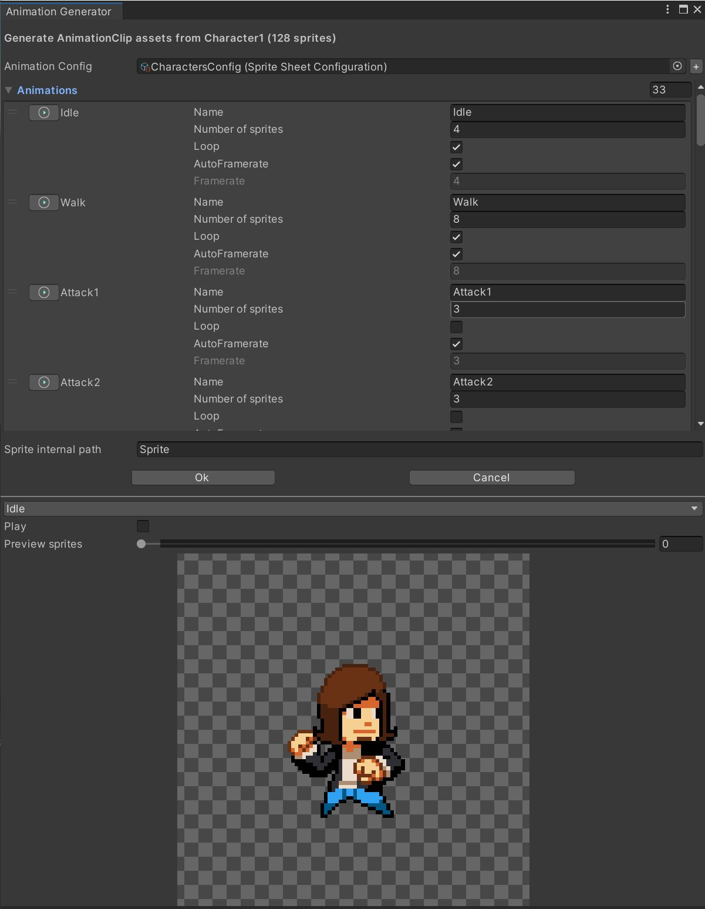

# Animation Generator

Generate **AnimationClip** assets from a **Texture2D** spritesheet asset, save and reuse the sprites mapping configuration.

## How to use

- Open the **AnimationGenerator** window by browsing the menu ***Window > Animation > AnimationGenerator***.
- Select a **Texture2D** spritesheet asset into the **Project View** (**SpriteMode** must be **multiple**).
- Select or create a **SpriteSheetConfiguration** asset (you can use the **[+]** button on the **AnimationGenerator** window or right-click on the **ProjectWindow** and browse ***Create > Sprite Sheet Configuration***).
- Add / remove / modify animations names, lengths (number of sprites), framerates, looping parameters.
  - You can preview each animation by clicking the button with the **Play** icon on it or selecting an animation name on the dropdown list.
  - You can preview each sprites by checking the **Play** checkbox or by seeking the **Preview Sprites** slider bar.
  - You can add an ***internal path*** for your sprites, usefull if the **SpriteRenderer** component is on a **GameObject** that is a child of the **GameObject** holding the **Animator** component.
- Generate the **AnimationClip** assets by clicking **Ok** and selecting a destination folder where all the assets will be created.

